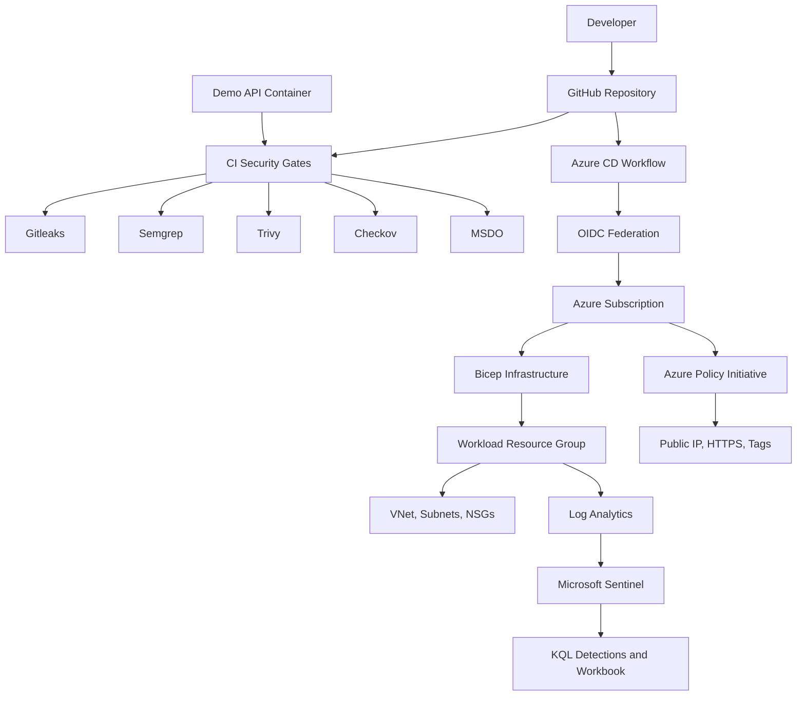

# Azure DevSecOps + Zero Trust Lab

Enterprise-grade DevSecOps and Zero Trust portfolio project on Azure. This repo
combines CI/CD security gates, Bicep infrastructure, Azure Policy governance,
Microsoft Sentinel detections, and a small demo API container that exists as a
real scan/build target.

## What Is Implemented

| Area | Status | Key files |
|---|---|---|
| Infrastructure as Code | Implemented | `infra/main.bicep`, `infra/modules/*.bicep`, `infra/parameters/*.bicepparam` |
| CI/CD security gates | Implemented | `.github/workflows/*.yml`, `pipeline/azure-devops/azure-pipelines.yml` |
| Azure Policy baseline | Implemented | `policy/main.bicep`, `policy/definitions/*.json`, `policy/parameters/*.bicepparam` |
| Sentinel detections | Implemented | `sentinel/detection-rules/*.kql`, `sentinel/workbooks/security-posture.json` |
| Demo app target | Implemented | `app/Dockerfile`, `app/src/zerotrust_demo/`, `app/tests/` |
| Security documentation | Implemented | `docs/architecture.md`, `docs/threat-model.md`, `docs/compliance-report.md`, `docs/kql-playbook.md` |
| Local helper scripts | Implemented | `scripts/setup-azure.sh`, `scripts/run-scans.sh`, `scripts/export-compliance.ps1` |

## Architecture



For the full design rationale, see `docs/architecture.md`.

## Prerequisites

Local validation:

- Azure CLI with Bicep support
- Bash shell, such as Git Bash, WSL, Linux, or macOS, for `scripts/*.sh`
- PowerShell 5.1+ or PowerShell 7+ for compliance evidence export
- Python 3.12 or compatible Python 3
- Git
- Gitleaks
- Semgrep
- Trivy
- Docker Desktop, optional for local Docker build
- Checkov, optional locally because CI installs it

Azure deployment:

- Azure subscription
- `az login`
- Required resource providers registered for Network, OperationalInsights, SecurityInsights, Authorization, Security, ManagedIdentity, and PolicyInsights
- GitHub OIDC federated credential for deployment from GitHub Actions
- GitHub secrets:
  - `AZURE_CLIENT_ID`
  - `AZURE_TENANT_ID`
  - `AZURE_SUBSCRIPTION_ID`

Azure DevOps deployment, optional:

- Azure Resource Manager service connection using Workload Identity Federation
- Service connection name expected by the template: `sc-azure-zerotrust-oidc`
- Microsoft Security DevOps Azure DevOps extension

## Quick Start

Clone and validate locally:

```powershell
git clone <your-repo-url>
cd azure-zerotrust-pipeline
```

Run the local helper script, skipping Docker if the Docker Desktop engine is not
running:

```bash
bash scripts/run-scans.sh --skip-docker
```

Or run individual checks while debugging:

```powershell

az bicep build --file infra\main.bicep
az bicep build --file policy\main.bicep

python -X utf8 -m unittest discover -s app\tests -v
gitleaks detect --source . --no-git --redact --verbose
semgrep scan --config p/owasp-top-ten --config p/secrets --error --metrics=off .
trivy fs --config trivy.yaml --scanners vuln,secret,misconfig --severity CRITICAL --exit-code 1 app
```

Build the demo app container when Docker Desktop is running:

```powershell
docker build --pull --tag azure-zerotrust-demo:local app
docker run --rm -p 8080:8080 azure-zerotrust-demo:local
```

Smoke test:

```powershell
Invoke-WebRequest http://127.0.0.1:8080/healthz
Invoke-WebRequest http://127.0.0.1:8080/api/v1/posture
```

## Helper Scripts

Local scan runner:

```bash
bash scripts/run-scans.sh
bash scripts/run-scans.sh --skip-docker
bash scripts/run-scans.sh --sarif --no-fail-fast
```

Azure setup validation. This checks login, provider state, Bicep build, validate,
and what-if. It does not deploy resources:

```bash
bash scripts/setup-azure.sh --environment dev
bash scripts/setup-azure.sh --environment prod --skip-what-if
bash scripts/setup-azure.sh --environment dev --register-providers
```

Compliance evidence export. Generated files are written under `reports/`, which
is ignored by Git because exports can contain subscription and resource IDs:

```powershell
powershell.exe -NoProfile -ExecutionPolicy Bypass -File scripts\export-compliance.ps1 -Environment dev -SkipAzure
powershell.exe -NoProfile -ExecutionPolicy Bypass -File scripts\export-compliance.ps1 -Environment dev -RunWhatIf
```

## Validation Commands

Run the full local pre-flight:

```bash
bash scripts/run-scans.sh --skip-docker
```

Bicep:

```powershell
az bicep build --file infra\main.bicep
az bicep build --file policy\main.bicep

az bicep build-params --file infra\parameters\dev.bicepparam --stdout
az bicep build-params --file infra\parameters\prod.bicepparam --stdout
az bicep build-params --file policy\parameters\dev.bicepparam --stdout
az bicep build-params --file policy\parameters\prod.bicepparam --stdout
```

JSON/YAML/KQL/test checks:

```powershell
python -X utf8 -c "import json, pathlib; files=[p for p in pathlib.Path('.').rglob('*.json') if '.git' not in p.parts]; [json.load(open(p, encoding='utf-8')) for p in files]; print('json ok:', len(files))"

python -X utf8 -c "import pathlib, yaml; files=[p for p in pathlib.Path('.').rglob('*.yml') if '.git' not in p.parts]+[p for p in pathlib.Path('.').rglob('*.yaml') if '.git' not in p.parts]; [yaml.safe_load(p.read_text(encoding='utf-8')) for p in files]; print('yaml ok:', len(files))"

python -X utf8 -m unittest discover -s app\tests -v
python -X utf8 -m compileall app\src app\tests
```

Security scans:

```powershell
gitleaks detect --source . --no-git --redact --verbose
semgrep scan --config p/owasp-top-ten --config p/secrets --error --metrics=off .
trivy fs --config trivy.yaml --scanners vuln,secret,misconfig --severity CRITICAL --exit-code 1 app
checkov --directory infra --framework bicep --quiet --soft-fail
```

## Azure Deployment

Start with validation and what-if. These commands do not deploy resources:

```bash
bash scripts/setup-azure.sh --environment dev
```

Manual equivalent:

```powershell
az login

az deployment sub validate `
  --location southeastasia `
  --template-file infra/main.bicep `
  --parameters infra/parameters/dev.bicepparam

az deployment sub what-if `
  --location southeastasia `
  --template-file infra/main.bicep `
  --parameters infra/parameters/dev.bicepparam

az deployment sub validate `
  --location southeastasia `
  --template-file policy/main.bicep `
  --parameters policy/parameters/dev.bicepparam

az deployment sub what-if `
  --location southeastasia `
  --template-file policy/main.bicep `
  --parameters policy/parameters/dev.bicepparam
```

Deploy dev after reviewing what-if output:

```powershell
az deployment sub create `
  --name zt-infra-dev `
  --location southeastasia `
  --template-file infra/main.bicep `
  --parameters infra/parameters/dev.bicepparam

az deployment sub create `
  --name zt-policy-dev `
  --location southeastasia `
  --template-file policy/main.bicep `
  --parameters policy/parameters/dev.bicepparam
```

Production parameters are stricter:

- `policy/parameters/prod.bicepparam` uses `deny` for public IP and HTTPS, `modify` for tags, and creates remediation tasks.
- `infra/parameters/prod.bicepparam` includes Defender Standard plan definitions but keeps `enableDefenderPlans = false` until intentionally enabled.
- Conditional Access deployment remains disabled until Graph permissions and break-glass user object IDs are configured.

## CI/CD

GitHub Actions:

- `.github/workflows/ci-security.yml`
  - Gitleaks
  - Semgrep OWASP and secrets rules
  - Trivy container/filesystem scan
  - Checkov Bicep scan
  - Microsoft Security DevOps
- `.github/workflows/cd-azure.yml`
  - Bicep validation
  - Azure what-if
  - Azure deployment through OIDC

Azure DevOps:

- `pipeline/azure-devops/azure-pipelines.yml`
  - Same security gate sequence
  - AzureCLI deployment through an OIDC service connection

## Azure Policy

Custom policies:

- `deny-public-ip.json`: audit or deny public IP address resources.
- `require-https.json`: audit or deny Storage and App Service resources without HTTPS-only settings.
- `enforce-tags.json`: audit or modify required tags with remediation support.

Deployment entry point:

```powershell
az deployment sub what-if `
  --location southeastasia `
  --template-file policy/main.bicep `
  --parameters policy/parameters/dev.bicepparam
```

## Sentinel

Detection rules:

- `sentinel/detection-rules/lateral-movement.kql`
- `sentinel/detection-rules/privilege-escalation.kql`
- `sentinel/detection-rules/secrets-exfiltration.kql`

Workbook:

- `sentinel/workbooks/security-posture.json`

Rule documentation:

- `docs/kql-playbook.md`

The KQL rules are source-validated but still need live tuning against a real Log
Analytics workspace.

## Demo App

The demo API is intentionally small and dependency-light. It provides a real
container and test target for the pipeline.

Endpoints:

- `GET /healthz`
- `GET /readyz`
- `GET /api/v1/posture`
- `POST /api/v1/events/security`

Run tests:

```powershell
python -X utf8 -m unittest discover -s app\tests -v
```

## Current Known Gaps

- Azure validate/what-if requires `az login` and a subscription.
- Local Docker build requires Docker Desktop engine to be running.
- Local Checkov requires Checkov to be installed; CI installs it automatically.
- Sentinel KQL needs real Log Analytics data before production tuning.
- App hosting infrastructure is not implemented yet; the app currently exists as a scan-ready container target.

## Repository Map

```text
.
|-- app/                 # Demo API, Dockerfile, and tests
|-- docs/                # Architecture, STRIDE, CIS report, KQL playbook
|-- infra/               # Bicep infrastructure modules and parameters
|-- pipeline/            # Azure DevOps pipeline and mirrored GitHub workflow templates
|-- policy/              # Azure Policy definitions, assignment, remediation
|-- sentinel/            # KQL detection rules and workbook JSON
|-- scripts/             # Local scan, Azure validation, and compliance export helpers
|-- .github/workflows/   # Active GitHub Actions workflows
`-- README.md
```
