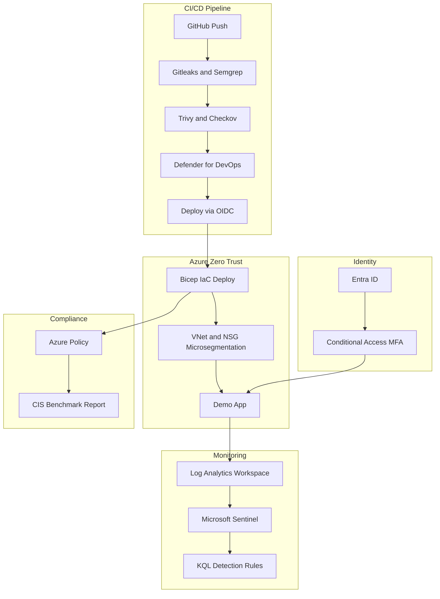

# Azure DevSecOps + Zero Trust Lab

Enterprise-grade DevSecOps pipeline on Azure with CI/CD security automation,
Zero Trust architecture, and compliance-as-code.

## Architecture



## Quick Start

```bash
# TODO: Login to Azure.
az login

# TODO: Bootstrap environment.
bash scripts/setup-azure.sh

# TODO: Deploy infrastructure when Bicep modules are implemented.
az deployment sub create \
  --location southeastasia \
  --template-file infra/main.bicep \
  --parameters infra/parameters/dev.bicepparam

# TODO: Run local security scans.
bash scripts/run-scans.sh
```

## Project Status

This repository currently contains the starter scaffold only. Implementation
logic, Azure resources, CI/CD gates, policies, and KQL queries should be added
module by module.

