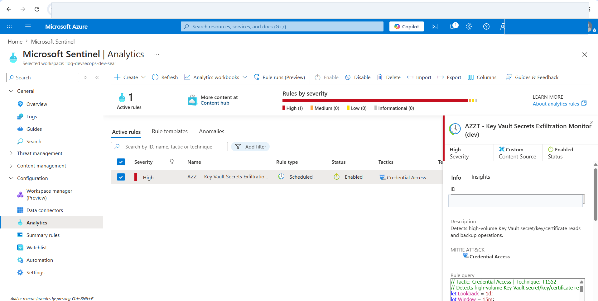
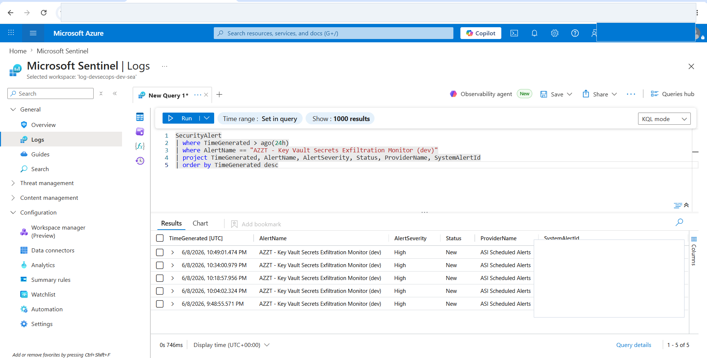
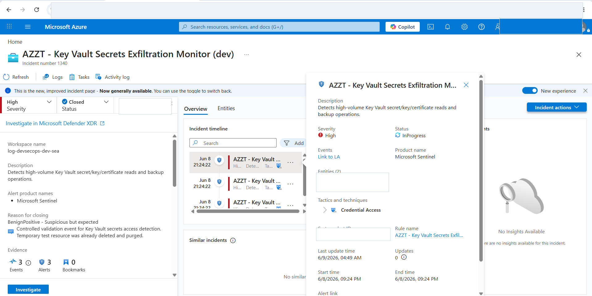
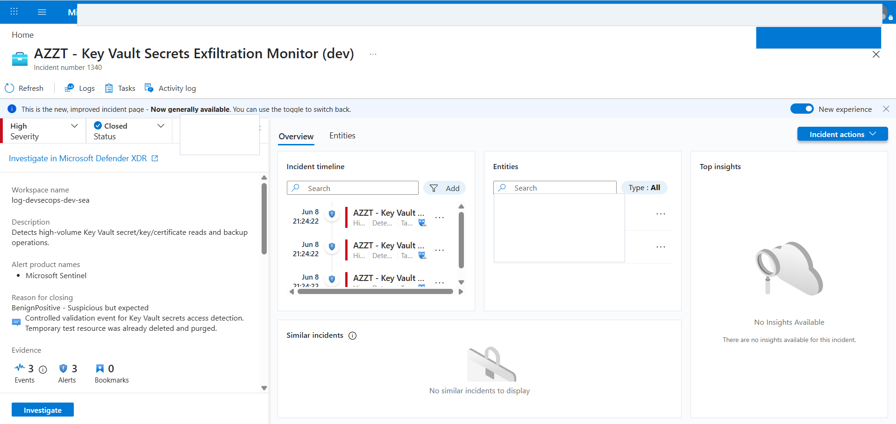
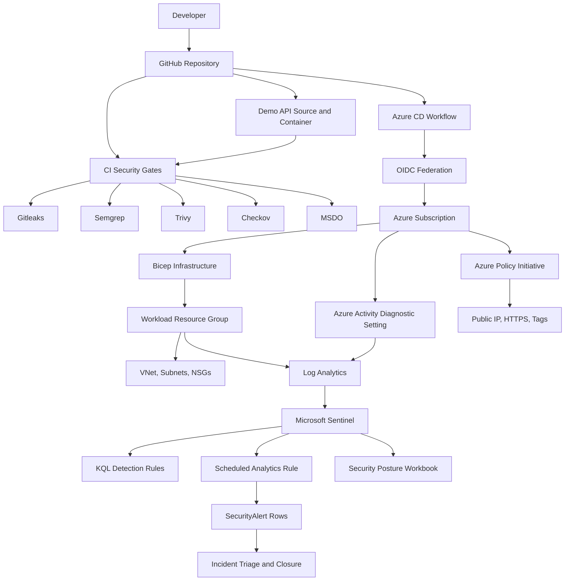

# Azure DevSecOps and Zero Trust Lab

This project is an Azure DevSecOps and Zero Trust lab that simulates an enterprise-style environment. It covers CI/CD security gates, Infrastructure as Code with Bicep, Azure Policy governance, threat detection with Microsoft Sentinel, and a small demo API container that acts as a real target for scanning, building, and testing the security pipeline.

## What Is Implemented

| Area | Status | Key files |
|---|---|---|
| Infrastructure as Code | Implemented | `infra/main.bicep`, `infra/modules/*.bicep`, `infra/parameters/*.bicepparam` |
| CI/CD security gates | Implemented | `.github/workflows/*.yml`, `pipeline/azure-devops/azure-pipelines.yml` |
| Azure Policy baseline | Implemented | `policy/main.bicep`, `policy/definitions/*.json`, `policy/parameters/*.bicepparam` |
| Sentinel detections | Implemented | `sentinel/detection-rules/*.kql`, `sentinel/workbooks/security-posture.json` |
| Demo app target | Implemented | `app/Dockerfile`, `app/src/zerotrust_demo/`, `app/tests/` |
| Security documentation | Implemented | `docs/architecture.md`, `docs/threat-model.md`, `docs/compliance-report.md`, `docs/kql-playbook.md` |
| Local helper scripts | Implemented | `scripts/setup-azure.sh`, `scripts/run-scans.sh`, `scripts/export-compliance.ps1` |

## Portfolio Case Study

For a public-safe case study with redacted screenshots, see:
[`docs/portfolio-case-study.md`](docs/portfolio-case-study.md)

To open the interactive static demo dashboard locally, open:
[`docs/demo-dashboard/index.html`](docs/demo-dashboard/index.html)

The dashboard links to the case study and KQL playbook views with public-safe screenshots. It is designed for presenting the project results in a format that is safe to share publicly.

## Evidence Preview

Public-safe screenshot previews are embedded below. Click any image to open the full-size version. The complete interactive evidence set is available through the demo dashboard.

<table>
  <tr>
    <td width="50%">
      <a href="docs/portfolio/assets/github-ci-security-success.png">
        
      </a>
      <br>
      <strong>CI Security</strong> - secrets, SAST, container, IaC, and MSDO gates all passed.
    </td>
    <td width="50%">
      <a href="docs/portfolio/assets/github-cd-azure-what-if-success.png">
        
      </a>
      <br>
      <strong>CD Azure What-If</strong> - Bicep validation and Azure what-if passed through GitHub OIDC.
    </td>
  </tr>
  <tr>
    <td width="50%">
      <a href="docs/portfolio/assets/azure-rg-devsecops-dev-sea-resources.png">
        
      </a>
      <br>
      <strong>Azure Resources</strong> - Log Analytics, Sentinel solution, VNet, and NSGs are deployed.
    </td>
    <td width="50%">
      <a href="docs/portfolio/assets/azure-policy-assignment-azzt-cis-dev-sea-detail.png">
        
      </a>
      <br>
      <strong>Azure Policy</strong> - dev baseline assigned in audit-style <code>DoNotEnforce</code> mode.
    </td>
  </tr>
  <tr>
    <td width="50%">
      <a href="docs/portfolio/assets/sentinel-scheduled-analytics-rule-created.png">
        
      </a>
      <br>
      <strong>Scheduled Analytics Rule</strong> - Key Vault secrets access monitor enabled in Sentinel.
    </td>
    <td width="50%">
      <a href="docs/portfolio/assets/sentinel-securityalert-keyvault-rule.png">
        
      </a>
      <br>
      <strong>SecurityAlert Evidence</strong> - scheduled rule generated high severity alerts.
    </td>
  </tr>
  <tr>
    <td width="50%">
      <a href="docs/portfolio/assets/sentinel-alert-detail-keyvault-secrets.png">
        
      </a>
      <br>
      <strong>Alert Detail</strong> - Sentinel alert mapped to account and IP entities.
    </td>
    <td width="50%">
      <a href="docs/portfolio/assets/sentinel-incident-closed-benign-positive.png">
        
      </a>
      <br>
      <strong>Incident Lifecycle</strong> - controlled validation incident triaged and closed.
    </td>
  </tr>
</table>

## Summary

This lab demonstrates a secure Azure delivery workflow from source control to cloud validation:

- CI security gates run layered security checks, including secrets scanning, SAST, container scanning, IaC scanning, and Microsoft Security DevOps.
- CD with GitHub OIDC authenticates to Azure without long-lived Azure credentials, validates Bicep, and runs a dev what-if before deployment.
- Azure Policy Governance assigns a Custom Zero Trust Baseline Policy in `DoNotEnforce` mode so the dev environment can be reviewed and validated without blocking iteration.
- Microsoft Sentinel receives and analyzes Azure telemetry, runs a scheduled analytics rule, generates high severity alerts, and provides evidence for incident triage and closure.
- Temporary validation resources are cleaned up after evidence capture to reduce risk and control cost.

## Measured Outcomes

The results in this section are based on evidence captured from the lab. They validate that the controls work as designed; they are not percentage-based claims about reduced risk, cost, or response time.

| Measurement | Result |
|---|---:|
| CI security gates passed | 5 / 5, 100% |
| CD validation jobs passed | 2 / 2, 100% |
| Compliance export checks passed | 18 / 18, 100% |
| Checkov IaC failed findings after documented exceptions | 0 |
| Active dev Azure resources deployed | 6 |
| `AzureActivity` rows ingested during validation | 6 |
| Key Vault `AuditEvent` rows ingested during validation | 121 |
| High severity KQL detections generated | 1 |
| Secret operations observed by the detection | 60 |
| Detection threshold multiplier | 3x over the threshold of 20 |
| Scheduled Sentinel `SecurityAlert` rows generated | 5 |
| Detection-to-incident lifecycle | Captured with alert, incident, triage, and closure evidence |
| Temporary Key Vault validation resource cleanup | Deleted and purged |

This project intentionally avoids numerical claims such as "reduced risk by X%" or "reduced cost by Y%" because those claims require a baseline, a measurement window, and sufficient post-deployment data. The evidence in this project focuses on control coverage, validation pass rates, telemetry ingestion, detection behavior, incident lifecycle testing, and cleanup hygiene to demonstrate that the workflow and security controls are working in the simulated environment.

## Accepted Limitations And Tradeoffs

This project has some limitations because it runs in a student lab and a university-managed tenant. Those constraints affect permissions, cost, and the ability to enable some security controls. The accepted tradeoffs are:

- Entra ID `SigninLogs` and `AuditLogs` are not connected to the Log Analytics workspace because the lab account is in a university-managed tenant and does not have permission to configure tenant-level diagnostic settings.
  The identity detections are still implemented and documented. Full live-data tuning requires a tenant role such as Security Administrator or exported logs from an administrator.
- Defender Standard plans are defined as code, but they are disabled by default in the student lab to avoid paid plan cost.
  This is an accepted lab tradeoff and should be enabled in production after budget approval.
- Conditional Access and PIM automation are documented as production hardening steps, but they are not enforced in this tenant because they require tenant-level permissions and safe break-glass account planning.
- The dev Azure Policy baseline uses an audit-style `DoNotEnforce` assignment so controls and governance rules can be reviewed without blocking lab iteration.
- Sentinel rule-run preview evidence can lag or be unavailable at times, so the project also uses `SecurityAlert` query results and incident screenshots as supporting proof that scheduled analytics rules can generate alerts and incidents.

## Architecture



This diagram shows the main lab flow: a developer pushes code to GitHub, CI security gates validate the repository and app artifact, the Azure CD workflow validates infrastructure through OIDC, Bicep deploys Azure resources, Azure Policy governs the environment, and telemetry flows into Log Analytics so Microsoft Sentinel can run KQL detections, scheduled analytics rules, alerts, and incident lifecycle workflows.

For the full design rationale, see [`docs/architecture.md`](docs/architecture.md).

## Prerequisites

This section groups requirements by the workflow being tested. If you only want to view the documentation or demo dashboard, you do not need an Azure subscription. If you want to run validation, scanning, or deployment, prepare the tools and permissions below.

Local validation:

- Azure CLI with Bicep support, used to build, validate, and run what-if against Bicep templates before sending changes to Azure.
- Bash shell, such as Git Bash, WSL, Linux, or macOS, used to run helper scripts in `scripts/*.sh`.
- PowerShell 5.1+ or PowerShell 7+, used for compliance evidence export and Windows-side helper scripts.
- Python 3.12 or compatible Python 3, used for unit tests, syntax checks, and helper commands.
- Git, used to clone the repository, inspect working tree state, and capture commit metadata during compliance export.
- Gitleaks, used to detect secrets in source code before push or merge.
- Semgrep, used to run SAST with OWASP Top Ten and secrets rules.
- Trivy, used to scan vulnerabilities, secrets, and misconfigurations in the app/container context.
- Docker Desktop (optional), used to build and run the demo API container locally.
- Checkov (optional), used for local Bicep/IaC scanning. GitHub Actions installs it automatically.

Azure deployment:

- Azure subscription, used to create the dev resource group, Log Analytics workspace, Sentinel onboarding, VNet, NSGs, and Azure Policy assignments.
- `az login`, used to authenticate Azure CLI for local validate, what-if, deploy, and evidence export.
- Required resource providers registered before deployment: Network, OperationalInsights, OperationsManagement, SecurityInsights, Authorization, Security, ManagedIdentity, and PolicyInsights.
- GitHub OIDC federated credential, used by GitHub Actions to authenticate to Azure without a long-lived client secret.
- GitHub secrets, used to store workflow identifiers without hardcoding them in the repository:
  - `AZURE_CLIENT_ID`
  - `AZURE_TENANT_ID`
  - `AZURE_SUBSCRIPTION_ID`

Azure DevOps deployment, optional:

- Azure Resource Manager service connection using Workload Identity Federation for organizations that want to run the pipeline on Azure DevOps.
- Service connection name expected by the template: `sc-azure-zerotrust-oidc`.
- Microsoft Security DevOps Azure DevOps extension, used to add a security scanning stage comparable to GitHub Actions.

## Quick Start

Clone the repository and validate locally:

```powershell
# Clone the repository and enter the project folder
git clone https://github.com/ronnakrit303/azure-zerotrust-pipeline.git
cd azure-zerotrust-pipeline
```

Run the helper script while skipping Docker if the Docker Desktop engine is not running:

```bash
# Run local security checks while skipping Docker if Docker Desktop is not ready
bash scripts/run-scans.sh --skip-docker
```

Or run individual checks while debugging:

```powershell
# Confirm that the infra and policy Bicep templates build successfully
az bicep build --file infra\main.bicep
az bicep build --file policy\main.bicep

# Run unit tests for the demo app
python -X utf8 -m unittest discover -s app\tests -v

# Scan the repository for secrets
gitleaks detect --source . --no-git --redact --verbose

# Run SAST with Semgrep OWASP Top Ten and secrets rules
semgrep scan --config p/owasp-top-ten --config p/secrets --error --metrics=off .

# Scan the demo app filesystem/container context with Trivy
trivy fs --config trivy.yaml --scanners vuln,secret,misconfig --severity CRITICAL --exit-code 1 app
```

Build the demo app container when Docker Desktop is running:

```powershell
# Build the Docker image for the demo API
docker build --pull --tag azure-zerotrust-demo:local app

# Run the demo API container locally on port 8080
docker run --rm -p 8080:8080 azure-zerotrust-demo:local
```

Smoke test:

```powershell
# Confirm that the container responds on the health endpoint
Invoke-WebRequest http://127.0.0.1:8080/healthz

# Confirm that the demo Zero Trust posture endpoint responds
Invoke-WebRequest http://127.0.0.1:8080/api/v1/posture
```

## Helper Scripts

Local scan runner:

```bash
# Run all local scans
bash scripts/run-scans.sh

# Run local scans while skipping Docker-related checks
bash scripts/run-scans.sh --skip-docker

# Produce SARIF output and continue even if a scan fails, useful for debugging
bash scripts/run-scans.sh --sarif --no-fail-fast
```

Azure setup validation checks login, provider state, Bicep build, validate, and what-if without deploying resources:

```bash
# Check provider state, Bicep build, validate, and what-if for dev
bash scripts/setup-azure.sh --environment dev

# Check production parameters while skipping what-if
bash scripts/setup-azure.sh --environment prod --skip-what-if

# Register required Azure resource providers, then run dev validation
bash scripts/setup-azure.sh --environment dev --register-providers
```

`Microsoft.OperationsManagement` is required for Microsoft Sentinel onboarding on the Log Analytics workspace. If Sentinel deployment fails with `MissingSubscriptionRegistration`, register that provider and rerun infra deployment after reviewing the what-if output.

Compliance evidence export creates files under `reports/`, which is ignored by Git because the output can contain subscription IDs and resource IDs:

```powershell
# Export compliance evidence locally without calling Azure APIs
powershell.exe -NoProfile -ExecutionPolicy Bypass -File scripts\export-compliance.ps1 -Environment dev -SkipAzure

# Export compliance evidence with Azure evidence and deployment what-if
powershell.exe -NoProfile -ExecutionPolicy Bypass -File scripts\export-compliance.ps1 -Environment dev -RunWhatIf
```

## Validation Commands

Run the full local pre-flight:

```bash
# Run core local pre-flight security checks while skipping Docker
bash scripts/run-scans.sh --skip-docker
```

Bicep:

```powershell
# Build Bicep templates to check syntax and module references
az bicep build --file infra\main.bicep
az bicep build --file policy\main.bicep

# Build parameter files to confirm dev/prod parameters are valid
az bicep build-params --file infra\parameters\dev.bicepparam --stdout
az bicep build-params --file infra\parameters\prod.bicepparam --stdout
az bicep build-params --file policy\parameters\dev.bicepparam --stdout
az bicep build-params --file policy\parameters\prod.bicepparam --stdout
```

JSON/YAML/KQL/test checks:

```powershell
# Confirm that all JSON files parse successfully
python -X utf8 -c "import json, pathlib; files=[p for p in pathlib.Path('.').rglob('*.json') if '.git' not in p.parts]; [json.load(open(p, encoding='utf-8')) for p in files]; print('json ok:', len(files))"

# Confirm that all YAML/YML files parse successfully
python -X utf8 -c "import pathlib, yaml; files=[p for p in pathlib.Path('.').rglob('*.yml') if '.git' not in p.parts]+[p for p in pathlib.Path('.').rglob('*.yaml') if '.git' not in p.parts]; [yaml.safe_load(p.read_text(encoding='utf-8')) for p in files]; print('yaml ok:', len(files))"

# Run unit tests for the demo app
python -X utf8 -m unittest discover -s app\tests -v

# Compile Python source to catch syntax errors
python -X utf8 -m compileall app\src app\tests
```

Security scans:

```powershell
# Scan the repository for secrets
gitleaks detect --source . --no-git --redact --verbose

# Run SAST with Semgrep OWASP Top Ten and secrets rules
semgrep scan --config p/owasp-top-ten --config p/secrets --error --metrics=off .

# Scan vulnerabilities, secrets, and misconfigurations in the app directory
trivy fs --config trivy.yaml --scanners vuln,secret,misconfig --severity CRITICAL --exit-code 1 app

# Scan Bicep/IaC with Checkov using soft-fail for local review
checkov --directory infra --framework bicep --quiet --soft-fail
```

## Azure Deployment

Start with validation and what-if. These commands do not deploy resources:

```bash
# Run Azure validation and what-if for dev without deploying resources
bash scripts/setup-azure.sh --environment dev
```

Manual equivalent:

```powershell
# Login to Azure CLI with an account that has subscription access
az login

# Validate infra deployment at subscription scope
az deployment sub validate `
  --location southeastasia `
  --template-file infra/main.bicep `
  --parameters infra/parameters/dev.bicepparam

# Preview infra deployment changes before deploying
az deployment sub what-if `
  --location southeastasia `
  --template-file infra/main.bicep `
  --parameters infra/parameters/dev.bicepparam

# Validate policy deployment at subscription scope
az deployment sub validate `
  --location southeastasia `
  --template-file policy/main.bicep `
  --parameters policy/parameters/dev.bicepparam

# Preview policy deployment changes before deploying
az deployment sub what-if `
  --location southeastasia `
  --template-file policy/main.bicep `
  --parameters policy/parameters/dev.bicepparam
```

Deploy dev after reviewing the what-if output:

```powershell
# Deploy dev infra resources after reviewing what-if
az deployment sub create `
  --name zt-infra-dev `
  --location southeastasia `
  --template-file infra/main.bicep `
  --parameters infra/parameters/dev.bicepparam

# Deploy the dev Azure Policy baseline after reviewing what-if
az deployment sub create `
  --name zt-policy-dev `
  --location southeastasia `
  --template-file policy/main.bicep `
  --parameters policy/parameters/dev.bicepparam
```

Production parameters are configured to be stricter than dev:

- `policy/parameters/prod.bicepparam` uses `deny` for public IP and HTTPS controls, uses `modify` for tags, and creates remediation tasks.
- `infra/parameters/prod.bicepparam` prepares Defender Standard plan definitions, but keeps `enableDefenderPlans = false` until the plans are intentionally enabled.
- Conditional Access deployment remains disabled until Graph permissions are configured and break-glass user object IDs are defined.

## CI/CD

This project separates the pipeline into two main parts: CI for checking the security of code and artifacts before merge/deploy, and CD for validating infrastructure delivery to Azure through GitHub OIDC without storing long-lived Azure credentials in the repository.

GitHub Actions:

- `.github/workflows/ci-security.yml` acts as the repository security quality gate.
  - Gitleaks detects secrets or credentials that may have been committed to source code.
  - Semgrep runs SAST with OWASP Top Ten and secrets rules to identify risky code patterns.
  - Trivy scans the container/filesystem context for vulnerabilities, secrets, and misconfigurations.
  - Checkov checks whether Bicep/IaC aligns with the security baseline and documented exceptions.
  - Microsoft Security DevOps adds Microsoft security tooling to broaden pipeline coverage.
- `.github/workflows/cd-azure.yml` validates Azure delivery before real deployment.
  - Bicep validation checks whether the infra and policy templates can deploy according to schema.
  - Azure what-if previews deployment impact before resources are created or changed.
  - Azure deployment uses GitHub OIDC to authenticate to Azure without a long-lived client secret.
  - In this lab validation run, the deploy job is intentionally skipped and what-if is used to prove that secrets, OIDC, and permissions work.

Azure DevOps:

- `pipeline/azure-devops/azure-pipelines.yml` is a parallel pipeline template for organizations that use Azure DevOps.
  - It uses the same security gate sequence as GitHub Actions to keep the workflow consistent.
  - It uses AzureCLI deployment through an OIDC service connection instead of storing a long-lived service principal secret.

## Azure Policy

Azure Policy is the governance layer of this project. It defines the security baseline as code so it can be reviewed, version-controlled, and validated before enforcement. The policy deployment is separated from the infrastructure deployment so the lifecycle of governance controls is easier to manage.

In the `dev` environment, the baseline is assigned in audit-style mode with `DoNotEnforce`, allowing the control impact to be reviewed without blocking experimentation. Production parameters are prepared to be stricter, such as using `deny` or `modify` when the team is ready to enforce controls.

Custom policies:

- `deny-public-ip.json` audits or blocks public IP address resources to reduce exposure for workloads that should not be Internet-facing.
- `require-https.json` audits or blocks Storage and App Service resources that do not enforce HTTPS-only settings, reducing the risk of unencrypted traffic.
- `enforce-tags.json` audits or modifies required tags with remediation support so resource governance, ownership, and cost tracking stay consistent.

What the policy layer proves:

- The security baseline is defined as code and can be reviewed over time.
- The dev environment can validate governance rules without stopping iteration.
- Production can move from audit-style mode to enforce mode when policy impact and remediation are ready.
- Compliance evidence export can capture policy assignments and compliance summaries as evidence.

Deployment entry point:

```powershell
# Preview Azure Policy deployment for dev before real deployment
az deployment sub what-if `
  --location southeastasia `
  --template-file policy/main.bicep `
  --parameters policy/parameters/dev.bicepparam
```

## Sentinel

Microsoft Sentinel is the detection and incident response layer of this lab. It uses the Log Analytics workspace as the central place to receive telemetry from Azure resources, then uses that data to test KQL detections, scheduled analytics rules, and incident lifecycle workflows.

Validated telemetry:

- `AzureActivity` receives control-plane activity from the subscription diagnostic setting for Azure management-plane monitoring.
- `AzureDiagnostics` receives Key Vault `AuditEvent` data from a temporary validation resource to test secrets access detection with real data.
- `SecurityAlert` confirms that the scheduled analytics rule can generate high severity alerts from the configured KQL rule.

Detection rules:

- `sentinel/detection-rules/lateral-movement.kql` detects behavior that may indicate lateral movement using identity sign-in telemetry.
- `sentinel/detection-rules/privilege-escalation.kql` detects role assignments, privilege changes, or related activity that may lead to privilege escalation.
- `sentinel/detection-rules/secrets-exfiltration.kql` detects high-volume Key Vault secret/key/certificate reads and backup operations. This rule has been validated with live Key Vault telemetry.

Scheduled analytics and incident lifecycle:

- The scheduled analytics rule `AZZT - Key Vault Secrets Exfiltration Monitor (dev)` has been created in Sentinel.
- The rule generated `SecurityAlert` records with `High` severity from a controlled validation event.
- The alert mapped to account and IP entities to make triage easier.
- An incident was created from the rule, assigned to an owner, triaged, and closed as a benign positive with the reason recorded as a controlled validation event.

Workbook and documentation:

- `sentinel/workbooks/security-posture.json` is a workbook skeleton for a security posture dashboard.
- `docs/kql-playbook.md` explains data sources, detection rules, validation status, and limitations of the KQL rules.

One important limitation remains: rules that depend on Entra ID `SigninLogs` and `AuditLogs` are implemented and syntax-tested, but they cannot be fully live-data tuned in this tenant until tenant-level permission is available for Entra diagnostic settings.

## Demo App

The Demo App is a small API used as the sample workload for this project. Its purpose is not to be a full business application, but to provide a real target that the pipeline can build, test, containerize, and scan like a real project workflow.

The API is intentionally dependency-light to keep the security surface manageable and to give CI/CD security tools a real artifact to inspect, such as unit tests, Docker image, filesystem scan, and endpoint smoke tests.

Endpoints:

- `GET /healthz` checks whether the service is running and responding.
- `GET /readyz` checks service readiness before receiving traffic.
- `GET /api/v1/posture` returns sample posture/status data for the Zero Trust demo.
- `POST /api/v1/events/security` accepts sample security events for testing an event ingestion pattern.

What the Demo App proves:

- The pipeline can run unit tests against application code.
- The Docker image can be built and run locally.
- Trivy can scan the app/container context for vulnerabilities, secrets, and misconfigurations.
- Endpoint smoke tests can confirm that the built container responds as expected.
- The project has a sample workload that connects CI/CD security gates to an application artifact, not only infrastructure code.

Run tests:

```powershell
# Run unit tests for the demo API
python -X utf8 -m unittest discover -s app\tests -v
```

## Current Known Gaps

- Azure validate/what-if requires `az login` and a subscription.
- Local Docker build requires Docker Desktop engine to be running.
- Local Checkov requires Checkov to be installed; CI installs it automatically.
- Defender Standard Checkov checks are documented as lab exceptions because paid Defender plans are defined as code but disabled until budget review.
- Entra ID `SigninLogs` and `AuditLogs` are not connected in the student tenant, so identity detections require tenant-admin support before live tuning.
- Sentinel Key Vault detection has been validated in the lab, but production thresholds should be tuned against normal Key Vault access patterns.
- App hosting infrastructure is not implemented yet; the app currently exists as a scan-ready container target.

## Repository Map

```text
.
|-- app/                  # Demo API target for testing, building, and scanning
|-- docs/                 # Architecture, threat model, compliance, and KQL docs
|-- infra/                # Bicep modules for the Azure dev environment
|-- policy/               # Azure Policy baseline, assignments, and remediation
|-- sentinel/             # KQL detections, scheduled rule source, and workbook
|-- scripts/              # Helper scripts for scans, validation, and evidence export
|-- .github/workflows/    # GitHub Actions for CI security and Azure what-if
|-- pipeline/             # Azure DevOps pipeline template for a parallel workflow
`-- README.md             # Main README with project summary and usage
```
