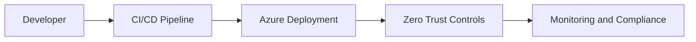

# Architecture

<!-- TODO: Document Zero Trust architecture decisions, Azure resource boundaries, and deployment rationale. -->

## Overview

This document will describe the target Azure architecture, trust boundaries,
identity flow, network segmentation, observability path, and compliance controls.

## Architecture Diagram

## Decision Log

| Date | Area | Decision | Rationale |
|---|---|---|---|
| 2026-06-04 | Infrastructure scope | Use subscription-scope `infra/main.bicep` to create one workload resource group and call scoped modules. | Keeps deployment repeatable from scratch while keeping resource group resources isolated. |
| 2026-06-04 | Network | Create app, management, and private endpoint subnets with explicit inbound deny NSG rules. | Supports Zero Trust microsegmentation and avoids public inbound access by default. |
| 2026-06-04 | Monitoring | Create Log Analytics with local auth disabled and onboard Microsoft Sentinel through `Microsoft.SecurityInsights/onboardingStates`. | Centralizes logs for detections and uses Azure RBAC-aware access. |
| 2026-06-04 | Identity | Manage Conditional Access with an opt-in deployment script that calls Microsoft Graph API. | Microsoft Graph Bicep resource types do not currently expose Conditional Access policies directly, so Graph API automation is required. |
| 2026-06-04 | Defender | Make Defender for Cloud plan configuration opt-in through parameters. | Defender Standard plans can incur cost and should be enabled intentionally. |
