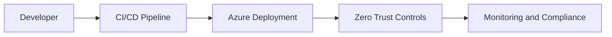

# Architecture

<!-- TODO: Document Zero Trust architecture decisions, Azure resource boundaries, and deployment rationale. -->

## Overview

This document will describe the target Azure architecture, trust boundaries,
identity flow, network segmentation, observability path, and compliance controls.

## Architecture Diagram

## Decision Log

| Date | Area | Decision | Rationale |
|---|---|---|---|
| TODO | TODO | TODO | TODO |

