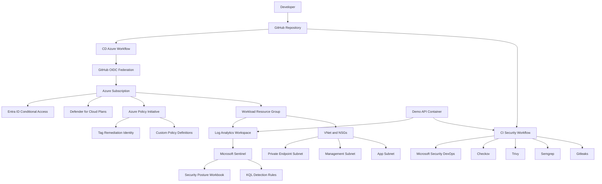

# Architecture

This document records the target architecture and design decisions for the
Azure DevSecOps + Zero Trust lab. The goal is to show a repeatable security
engineering workflow: code is scanned before deployment, Azure infrastructure is
defined as code, governance is enforced with Azure Policy, and detections are
documented for Microsoft Sentinel.

## Goals

- Build a portfolio-grade Azure security lab that can be reviewed from source.
- Keep deployments repeatable with Bicep and environment-specific parameters.
- Make security controls visible in CI, Azure Policy, and Sentinel detections.
- Prefer least privilege, private connectivity patterns, and audit-first rollout.
- Avoid hardcoded secrets and avoid subscription-scope Owner or Contributor.

## Non-Goals

- This repo is not a production landing zone.
- This repo does not claim live CIS compliance until deployed and assessed in Azure.
- Application hosting is represented by a demo container target, not a full AKS or App Service stack yet.
- Conditional Access and Defender Standard plans are opt-in because they require tenant permissions and may incur cost.

## Architecture Diagram

## Resource Boundaries

| Boundary | Implementation | Purpose |
|---|---|---|
| Subscription scope | `infra/main.bicep`, `policy/main.bicep` | Creates the workload resource group and subscription-level policy controls. |
| Resource group scope | `rg-<workload>-<env>-<region>` | Isolates lab resources by environment. |
| Network scope | `infra/modules/network.bicep` | Creates VNet, app subnet, management subnet, private endpoint subnet, and NSGs. |
| Identity scope | `infra/modules/identity.bicep` | Opt-in deployment script for Conditional Access through Microsoft Graph. |
| Monitoring scope | `infra/modules/sentinel.bicep` | Creates Log Analytics and Sentinel onboarding state. |
| Governance scope | `policy/main.bicep` | Creates custom policy definitions, initiative, assignment identity, and tag remediation tasks. |
| Application scope | `app/` | Provides a scan-ready demo API and Docker target for CI security gates. |

## Required Azure Resource Providers

The setup helper checks and optionally registers the resource providers needed
by the dev/prod templates:

| Provider | Why it is needed |
|---|---|
| `Microsoft.Resources` | Subscription deployments and workload resource group creation. |
| `Microsoft.Network` | VNet, subnets, and NSGs. |
| `Microsoft.OperationalInsights` | Log Analytics workspace. |
| `Microsoft.OperationsManagement` | Microsoft Sentinel onboarding dependency for the workspace. |
| `Microsoft.SecurityInsights` | Microsoft Sentinel onboarding state. |
| `Microsoft.ManagedIdentity` | Optional Conditional Access deployment identity and policy assignment identity support. |
| `Microsoft.Security` | Optional Defender for Cloud pricing plans. |
| `Microsoft.Authorization` | Custom Azure Policy definitions, initiatives, assignments, and RBAC. |
| `Microsoft.PolicyInsights` | Optional Azure Policy remediation tasks and compliance evidence. |

## Data Flows

| Flow | Source | Destination | Security Controls |
|---|---|---|---|
| Code push | Developer workstation | GitHub | Branch checks, Gitleaks, Semgrep, Trivy, Checkov, MSDO. |
| Deployment authentication | GitHub Actions | Azure Resource Manager | OIDC federation, no long-lived Azure secret required. |
| Infrastructure deployment | GitHub Actions or operator CLI | Azure subscription | Bicep templates, parameterized dev/prod configuration, least-privilege intent. |
| App telemetry | Demo app container | Log Analytics workspace | Structured JSON logs, Sentinel-ready fields, future diagnostic settings. |
| Detection triage | Sentinel tables | Workbook and analytics rules | KQL rules, MITRE mapping, documented investigation steps. |
| Governance remediation | Azure Policy managed identity | Azure resources | Tag Contributor role only when `tagEffect == modify`. |

## Trust Boundaries

| Boundary | Risk | Control |
|---|---|---|
| Developer to GitHub | Malicious commit, leaked secret, vulnerable code | Required CI security gates and secret scanning. |
| GitHub to Azure | Token theft or unauthorized deployment | OIDC, environment approvals, subscription-scoped deployment, no stored client secret. |
| Public network to workload | Public exposure and lateral movement | No public IP policy, NSG default-deny inbound, private endpoint subnet prepared. |
| Operator to Entra ID | Misconfigured tenant-wide access policy | Conditional Access disabled by default, report-only state, break-glass exclusion required. |
| Policy assignment to resources | Over-permissioned remediation identity | System-assigned identity, Tag Contributor only, remediation opt-in. |
| Logs to investigations | Missing context or false positives | Standardized detection columns and documented tuning thresholds. |

## Zero Trust Control Summary

| Pillar | Current Control | Status |
|---|---|---|
| Verify explicitly | Conditional Access MFA and legacy auth block through Graph deployment script | Ready to enable after Graph permissions and break-glass IDs are configured. |
| Use least privilege | Avoids broad Owner/Contributor assignment; tag remediation uses Tag Contributor | Implemented as code. |
| Assume breach | Sentinel rules for lateral movement, privilege escalation, and secrets exfiltration | Implemented as KQL, pending live workspace tuning. |
| Network segmentation | Separate app, management, and private endpoint subnets with NSG default-deny inbound | Implemented as Bicep. |
| Governance | Custom Azure Policy initiative for public IP, HTTPS, and tags | Implemented as policy-as-code. |
| Continuous assurance | CI gates for secrets, SAST, containers, IaC, and MSDO | Implemented in GitHub Actions and Azure DevOps pipeline templates. |

## Deployment Model

The deployment model is intentionally staged:

1. Run CI security gates on every push and pull request.
2. Deploy infrastructure in `dev` with audit/report-only controls.
3. Review policy and Sentinel findings.
4. Promote to `prod` by switching policy effects to `deny` or `modify`.
5. Enable Defender plans and Conditional Access only after cost and tenant permission review.

## Decision Log

| Date | Area | Decision | Rationale |
|---|---|---|---|
| 2026-06-04 | Infrastructure scope | Use subscription-scope `infra/main.bicep` to create one workload resource group and call scoped modules. | Keeps deployment repeatable from scratch while keeping resource group resources isolated. |
| 2026-06-04 | Network | Create app, management, and private endpoint subnets with explicit inbound deny NSG rules. | Supports Zero Trust microsegmentation and avoids public inbound access by default. |
| 2026-06-04 | Monitoring | Create Log Analytics with local auth disabled and onboard Microsoft Sentinel through `Microsoft.SecurityInsights/onboardingStates`. | Centralizes logs for detections and uses Azure RBAC-aware access. |
| 2026-06-04 | Identity | Manage Conditional Access with an opt-in deployment script that calls Microsoft Graph API. | Microsoft Graph Bicep resource types do not currently expose Conditional Access policies directly, so Graph API automation is required. |
| 2026-06-04 | Defender | Make Defender for Cloud plan configuration opt-in through parameters. | Defender Standard plans can incur cost and should be enabled intentionally. |
| 2026-06-08 | IaC scanning | Accept Checkov Defender Standard findings as documented lab exceptions. | Defender Standard plans are defined in code but disabled by default to avoid unplanned Azure for Students cost. |
| 2026-06-08 | Monitoring | Add `Microsoft.OperationsManagement` to the required provider list. | Sentinel onboarding can fail without this subscription provider registration. |
| 2026-06-04 | Pipeline | Run Gitleaks first, then Semgrep, Trivy, Checkov, and MSDO. | Fails fast on secrets and keeps later security gates dependent on clean earlier stages. |
| 2026-06-04 | Azure deployment | Use GitHub OIDC for Azure login and avoid stored client secrets. | Reduces secret management risk and aligns with workload identity federation. |
| 2026-06-04 | Azure Policy | Start `dev` with audit effects and `DoNotEnforce`, and reserve deny/modify for `prod`. | Supports safe rollout and avoids blocking expected lab changes before validation. |
| 2026-06-04 | Policy remediation | Use a policy assignment managed identity with Tag Contributor only when tag modify is enabled. | Keeps remediation scoped to the minimum role required for tag updates. |
| 2026-06-04 | Sentinel | Standardize KQL outputs on `TimeGenerated`, `AccountName`, `IPAddress`, `Action`, and `Severity`. | Makes analytics rule mapping, workbook triage, and incident review consistent. |
| 2026-06-04 | Application | Use a small Python stdlib HTTP API as the scan target. | Keeps the demo app dependency-light while still giving CI a real Docker and test target. |

## Operational Risks

| Risk | Current Handling | Next Step |
|---|---|---|
| Conditional Access can lock out administrators | Disabled by default and requires break-glass object IDs | Test in report-only mode before enforcement. |
| Defender Standard plans can create cost | Disabled by default | Enable only after budget review. |
| Checkov reports Defender Standard recommendations | `.checkov.yaml` records scoped exceptions for Defender checks | Revisit the exceptions before enabling paid Defender plans or promoting production. |
| Sentinel onboarding depends on subscription provider registration | `scripts/setup-azure.sh` checks `Microsoft.OperationsManagement` with the other required providers | Register providers before deployment and rerun what-if after registration changes. |
| KQL rules may generate false positives | Thresholds are documented in the playbook | Tune against real Log Analytics data. |
| Azure Policy deny effects can block deployments | Dev uses audit and `DoNotEnforce` | Promote effects gradually after impact review. |
| Docker local verification depends on Docker Desktop | CI runner has Docker by default | Re-run GitHub Actions after app changes. |

## References

- Microsoft Learn: Azure Policy regulatory compliance details for CIS Microsoft Azure Foundations Benchmark v2.0.0, https://learn.microsoft.com/en-us/azure/governance/policy/samples/cis-azure-2-0-0
- Microsoft Learn: Microsoft Sentinel scheduled analytics rules, https://learn.microsoft.com/en-us/azure/sentinel/scheduled-rules-overview
- Microsoft Learn: Map data fields to Microsoft Sentinel entities, https://learn.microsoft.com/en-us/azure/sentinel/map-data-fields-to-entities
- Microsoft Learn: Azure Monitor workbook time parameters, https://learn.microsoft.com/en-us/azure/azure-monitor/visualize/workbooks-time
