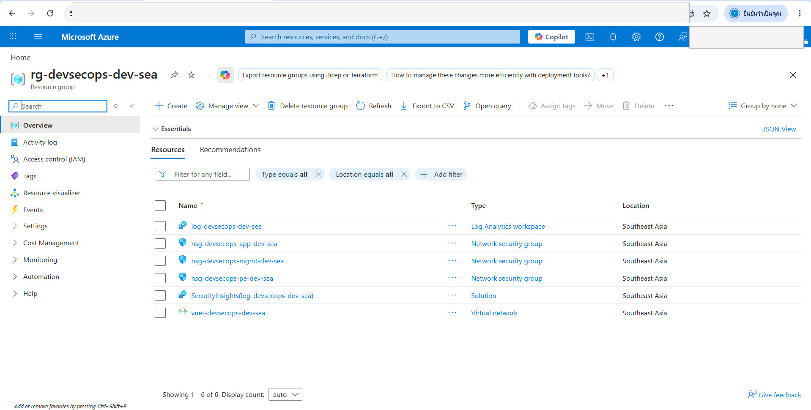
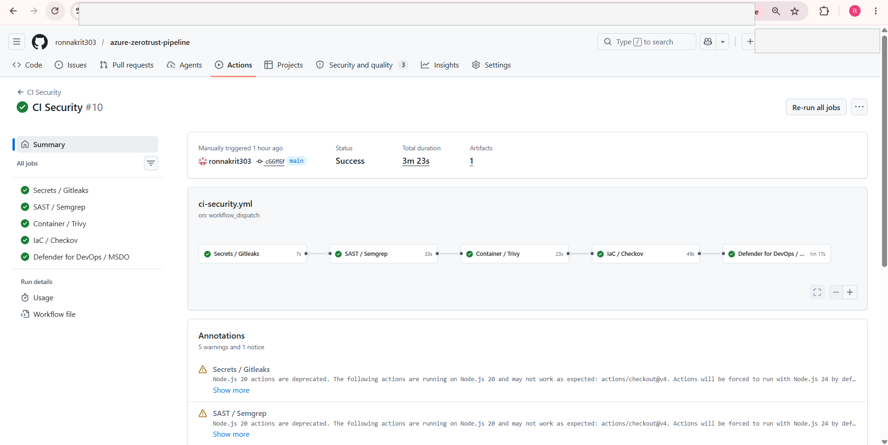
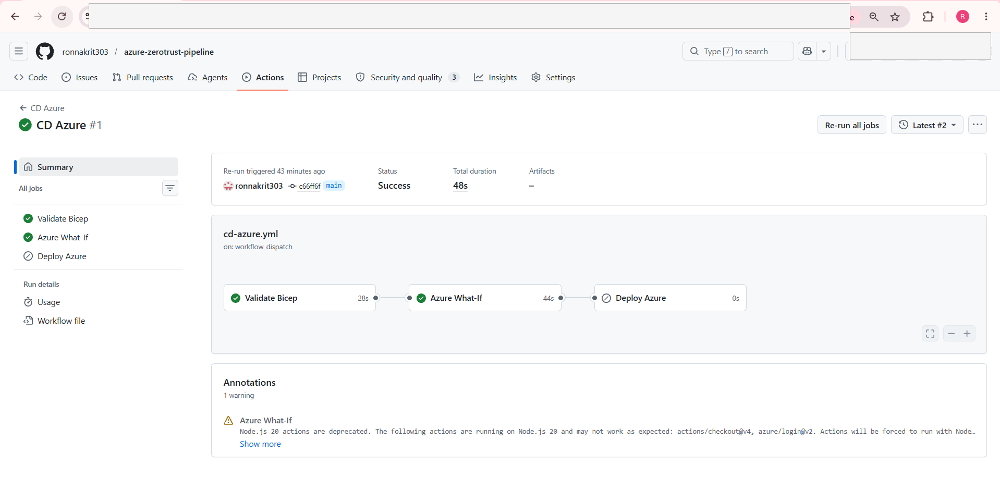
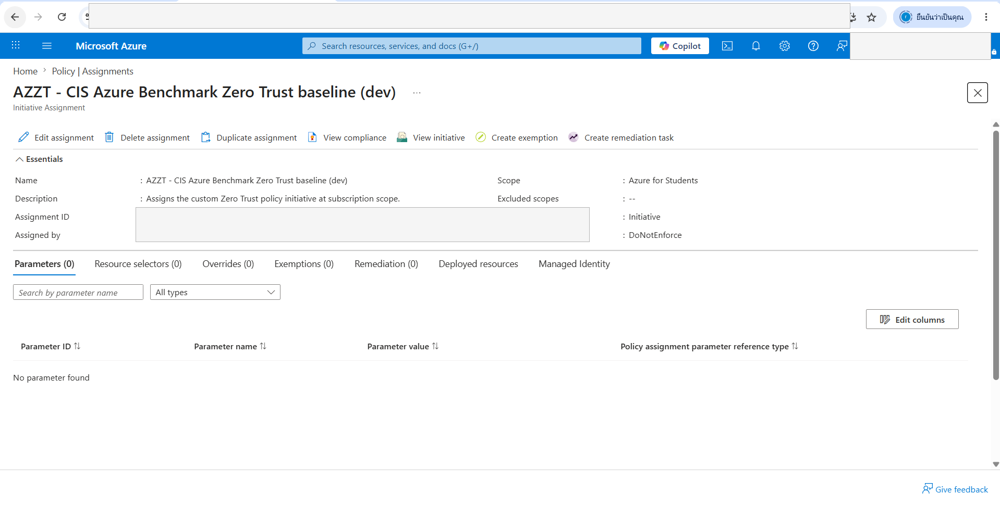
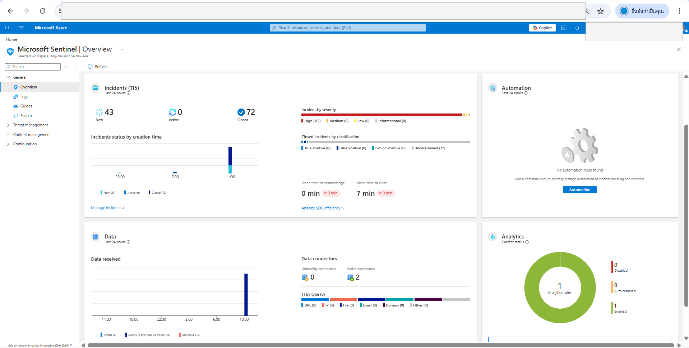
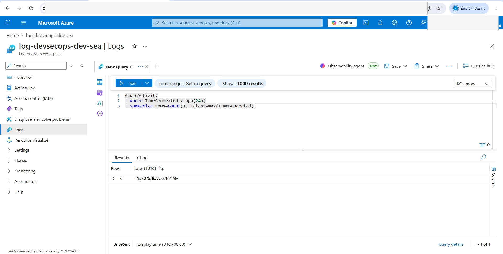
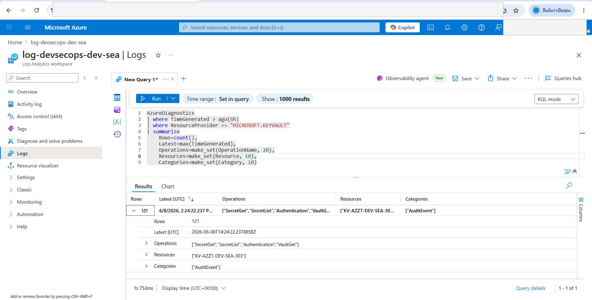
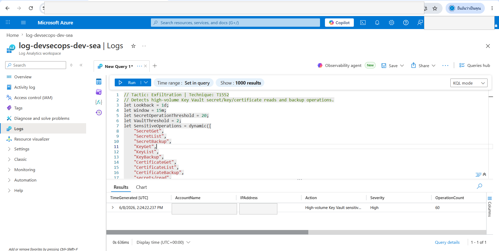

# Azure Zero Trust DevSecOps Portfolio Case Study

This case study summarizes a portfolio lab that validates a secure Azure delivery
pipeline with CI security gates, GitHub OIDC deployment, Azure Policy governance,
Microsoft Sentinel onboarding, and KQL detection testing.

Sensitive account, tenant, subscription, URL, IP, and identity details have been
redacted from public screenshots.

## Scope

The lab demonstrates:

- Secure GitHub Actions CI with secrets scanning, SAST, container scanning, IaC
  scanning, and Microsoft Security DevOps.
- GitHub Actions CD authentication to Azure through OIDC federation.
- Azure Bicep deployment validation and subscription-level what-if.
- Azure Policy assignment in `DoNotEnforce` mode for a dev baseline.
- Microsoft Sentinel onboarding backed by a Log Analytics workspace.
- Azure Activity ingestion into Log Analytics.
- Key Vault `AuditEvent` ingestion and live KQL validation for a secrets access
  detection.

## Architecture Outcome

The deployed dev environment includes a workload resource group with a Log Analytics
workspace, Microsoft Sentinel onboarding, a virtual network, and network security
groups. The policy baseline is assigned at subscription scope in audit-style dev mode.

## CI/CD Validation

The CI security workflow completed successfully with multiple security gates:

The Azure CD workflow successfully validated Bicep and ran a dev what-if through OIDC.
The deploy job was intentionally skipped for the what-if validation run.

## Governance Validation

The custom Azure Policy initiative is assigned in dev with policy enforcement set to
`DoNotEnforce`. This keeps the baseline visible and testable without blocking lab
iteration.

## Sentinel And Telemetry

Microsoft Sentinel was onboarded to the Log Analytics workspace.

Azure Activity diagnostic settings were connected to the workspace and validated with
real rows in `AzureActivity`.

## KQL Detection Validation

A temporary Key Vault test resource was created to validate the
`secrets-exfiltration.kql` detection. Key Vault `AuditEvent` diagnostics were sent to
Log Analytics, controlled `SecretGet` and `SecretList` operations were generated, and
the KQL rule produced a High severity detection.

The test Key Vault was deleted and purged after evidence capture so the lab does not
keep an unnecessary billable validation resource.

## Constraints And Tradeoffs

- Entra ID `SigninLogs` and `AuditLogs` were not connected because the lab account is
  in a university-managed Entra tenant without permission to configure
  `microsoft.aadiam` diagnostic settings.
- Defender Standard plans are documented as accepted lab tradeoffs because they can
  incur cost. The IaC scan exception is tracked with rationale and can be removed when
  the environment is ready for production cost assumptions.
- Conditional Access automation is disabled in this student tenant and documented as a
  production hardening step.

## Result

The lab proves an end-to-end DevSecOps workflow:

- security scanning passes in CI;
- Azure authentication works through OIDC;
- infrastructure and policy templates validate through what-if;
- Sentinel receives Azure telemetry;
- a Key Vault KQL detection fires on controlled live data;
- temporary validation resources are cleaned up after evidence capture.

## Public Summary

Built an Azure Zero Trust DevSecOps lab with GitHub Actions security gates, OIDC-based
Azure validation, Bicep infrastructure, Azure Policy governance, Microsoft Sentinel,
and KQL detection testing. Validated Azure Activity ingestion and produced a live High
severity Key Vault secrets access detection from controlled test telemetry, then
cleaned up the temporary validation resource.
